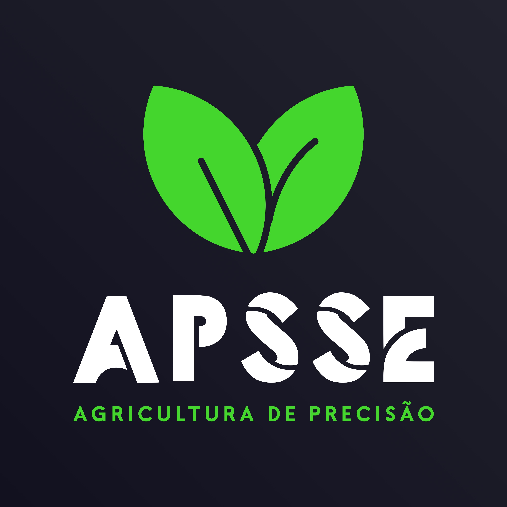
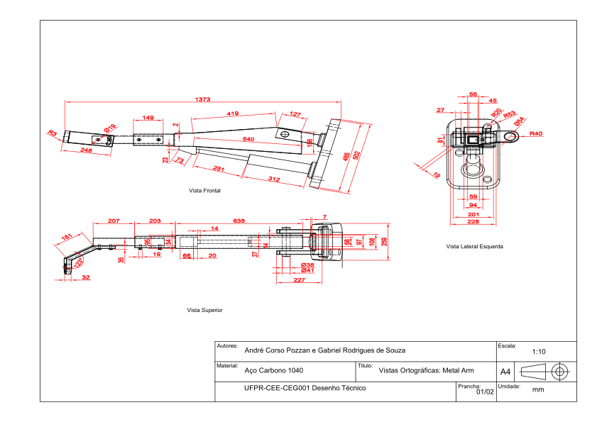
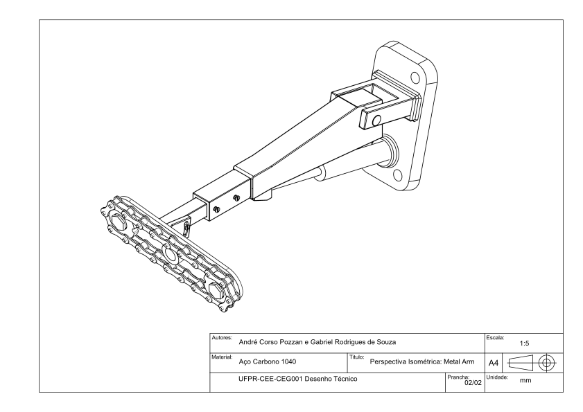
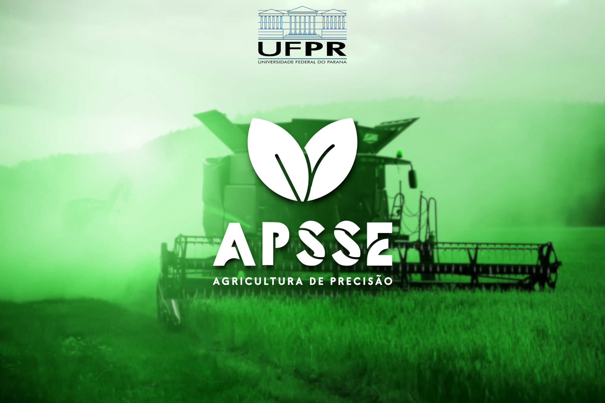

<h1 align="center">APSSE Technologies</h1>

APSSE is a startup that develops products for precision agriculture and is part of the startup experience initiative at the <a href="https://ufpr.br/" target="_blank">Federal University of Paraná</a>.

It is made up of undergraduate students from the electrical engineering course

## Media Contacts

<a href="https://www.instagram.com/apsse_technologies?utm_source=ig_web_button_share_sheet&igsh=ZDNlZDc0MzIxNw=="> APSSE Technologies Instagram </a>

<a href="https://www.linkedin.com/company/apsse-tecnologies-ufpr/"> APSSE Technologies Linkedin</a>

<a href="https://www.facebook.com/profile.php?id=61566150221510"> APSSE Technologies Facebook</a>

### Watch the Freecad timelapse of the project's development:

### Watch the 5min PITCH of the startup:

### APSSE Slide show:

## Technical drawings

---

---

APSSE TECHNOLOGIES © ALL RIGHTS RESERVED 

